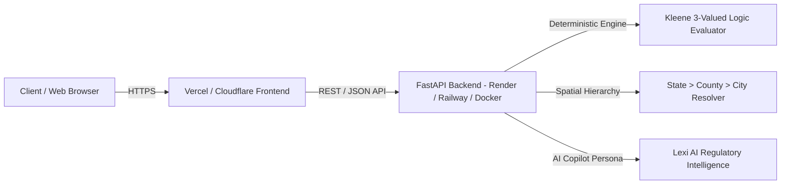

# RHLN Production Deployment Guide

This guide covers deployment procedures for the **Rental Housing Law Navigator (RHLN)** platform, configuring both the FastAPI backend and modern TanStack/React frontend for zero-downtime production hosting.

---

## Architecture Overview



---

## 1. Deploying Frontend to Vercel

The frontend is built with React 19, TypeScript, Tailwind CSS, and TanStack Start / Vite.

### Step 1: Push Repository to GitHub
Ensure the codebase is committed and pushed to your GitHub repository:
```bash
git add .
git commit -m "feat: complete RHLN regulatory intelligence platform"
git push origin master
```

### Step 2: Import Project on Vercel
1. Log in to [Vercel Dashboard](https://vercel.com).
2. Click **"Add New Project"** $\rightarrow$ **"Import Git Repository"**.
3. Set the **Root Directory** to `web`.
4. Vercel automatically detects the Vite / Node.js build configuration:
   - **Framework Preset**: Vite / Other
   - **Build Command**: `npm run build`
   - **Output Directory**: `.output/public` (or `dist`)
   - **Install Command**: `npm install`

### Step 3: Configure Frontend Environment Variables
Add the following environment variable in the Vercel Project Settings:
```env
VITE_API_URL=https://your-backend-service.onrender.com
```

### Step 4: Deploy
Click **"Deploy"**. Vercel will build the frontend bundle and generate an SSL-secured live URL (e.g. `https://rhln.vercel.app`).

---

## 2. Deploying Backend to Render / Railway / Fly.io

The backend is a high-performance Python FastAPI service located in `backend/`.

### Option A: Deploy on Render (Web Service)
1. Go to [Render Dashboard](https://render.com) $\rightarrow$ **"New +"** $\rightarrow$ **"Web Service"**.
2. Connect your GitHub repository.
3. Configure the service settings:
   - **Name**: `rhln-backend`
   - **Runtime**: `Python 3`
   - **Build Command**: `pip install -r requirements.txt`
   - **Start Command**: `uvicorn backend.api.main:app --host 0.0.0.0 --port $PORT`
4. Add Environment Variables:
   ```env
   PYTHON_VERSION=3.11.0
   CORS_ORIGINS=https://rhln.vercel.app,http://localhost:3000
   DEFAULT_AS_OF=2026-10-01
   ANTHROPIC_API_KEY=your_optional_api_key_here
   ```
5. Click **"Create Web Service"**.

---

### Option B: Deploy with Docker

A production multi-stage [`Dockerfile`](./Dockerfile) and [`docker-compose.yml`](./docker-compose.yml) are included in the repository.

```bash
# Build the production container
docker build -t rhln-api:latest .

# Run container exposing port 8000
docker run -d -p 8000:8000 \
  -e CORS_ORIGINS="*" \
  -e ANTHROPIC_API_KEY="your_api_key" \
  --name rhln-service rhln-api:latest
```

Or deploy both backend and local testing environment with docker-compose:
```bash
docker-compose up -d --build
```

---

## 3. Production Environment Configuration

| Variable | Default Value | Description |
|---|---|---|
| `PORT` | `8000` | Port for the ASGI server |
| `CORS_ORIGINS` | `*` | Allowed CORS origins (comma-separated for production) |
| `DEFAULT_AS_OF` | `2026-10-01` | Baseline query evaluation date |
| `ANTHROPIC_API_KEY` | *(optional)* | API key for Lexi live dynamic syntheses (falls back to deterministic legal reasoning if omitted) |
| `CLAUDE_MODEL` | `claude-sonnet-5-5` | Backend extraction model identifier |

---

## 4. Verification & Health Monitoring

Once deployed, verify backend uptime and delivery envelopes:

```bash
# Health Check
curl -I https://your-backend.onrender.com/api/v1/health

# Verify Address Lookup
curl -s -X POST https://your-backend.onrender.com/api/v1/lookup \
  -H "Content-Type: application/json" \
  -d '{"address":"2150 Shattuck Ave, Berkeley, CA 94704"}' | jq .data.results[0]

# Verify Official Deliverable Exports
curl -s https://your-backend.onrender.com/api/v1/exports/rules.json | head -n 10
```
